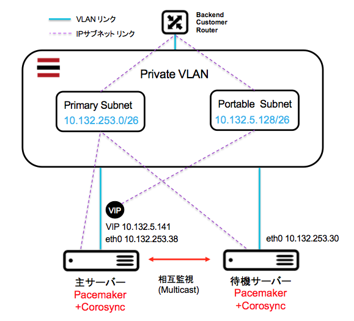

pm_corosync01 Cookbook
======================
CentOS 6.x/7.x で Pacemaker と Corosync を使ってアクティブ・スタンバイのクラスタを作るクックブックです。


システム構成
------------
このクックブックで構築する構成を次の図に表します。サービスを提供するためのVIPは、Portable SubnetのIPアドレスを利用します。アクティブとスタンバイのサーバーは、物理（ベアメタル）サーバーでも構いません。これらのサーバーにPacemaker + Corosync を設定して主サーバーが停止した場合、待機サーバーへのVIPの引き継ぎ、プロセスの起動、ファイルシステムのマウントなどを実行します。主サーバーと待機サーバーの相互監視はマルチキャストを利用するため、設定ファイルにクラスタのリストを設定する必要がありません。マルチキャストの同じグループに属するサーバーがクラスタのメンバーとなります。




前提条件
------------
OS

サーバー２台

ネットワーク


使い方
------------
最小限の


```
# curl -L https://www.opscode.com/chef/install.sh | bash
# knife cookbook create dummy -o /var/chef/cookbooks
# cd /var/chef/cookbooks
# git clone https://github.com/takara9/pm_corosync01
# chef-solo -o pm_corosync01
```


アトリビュ−ト
------------
ネットワークの設定、

#### pm_corosync01::default
<table>
  <tr>
    <th>Key</th>
    <th>Type</th>
    <th>Description</th>
    <th>Default</th>
  </tr>
  <tr>
    <td><tt>['pm_corosync01']['bacon']</tt></td>
    <td>Boolean</td>
    <td>whether to include bacon</td>
    <td><tt>true</tt></td>
  </tr>
</table>


Contributing
------------
TODO: (optional) If this is a public cookbook, detail the process for contributing. If this is a private cookbook, remove this section.

e.g.
1. Fork the repository on Github
2. Create a named feature branch (like `add_component_x`)
3. Write your change
4. Write tests for your change (if applicable)
5. Run the tests, ensuring they all pass
6. Submit a Pull Request using Github

License and Authors
-------------------
Authors: TODO: List authors
